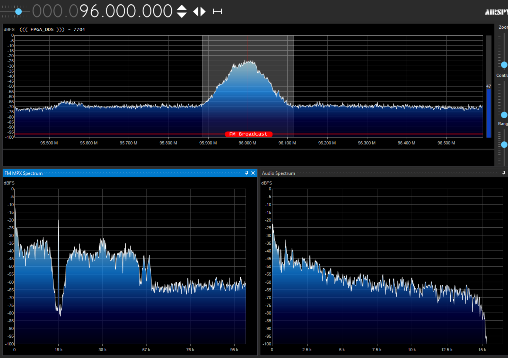

# Antminer S9 FM Stereo Modulator

**Stereo FM modulator based on Antminer S9 / Astra S9 FPGA board without external DAC.** Direct Digital Synthesis (DDS) for experimental FM broadcasting.

**Доступна русская версия:** [README на русском](README.md)

[]()
[-lightgrey)]()

## ⚠️ Important Warning
This is an **experimental project** for enthusiasts. The device may cause interference to other radio stations and services. Use with caution.

## 📋 Features
*   **Full digital signal path:** FM signal generation directly in Zynq FPGA
*   **High sound quality:** Direct Digital Synthesis (DDS) ensures clean sound with excellent detail and attack, comparable to or better than many industrial FM transmitters
*   **Stereo sound:** MPX signal formation with pilot tone
*   **RDS ready:** RDS modulator already implemented in FPGA, requires software part
*   **Various audio sources:**
    *   Internet radio (via VLC, MPC, gstreamer, madplay, etc.)
    *   Local audio files
*   **Axia LiveWire (AES67) streams:** Support for professional audio networks, including output from **StereoTool**
*   **Console management:** Utility for frequency adjustment, level monitoring, and transmitter control
*   **Low-cost solution:** Uses old mining boards

---

## 📸 Demonstration

### Project Architecture


*Overall project architecture: interaction between Linux kernel (PS) and programmable logic (PL) on Zynq board*

### Project in Vivado


*Project schematic in Vivado with DDS and MPX modulator implementation*

### Spectrum in SDR#


*MPX signal spectrum in SDR#: main L+R channel (up to 15 kHz), 19 kHz pilot tone, L-R 38 kHz stereo subcarrier, and RDS at 57 kHz*

### Board Preparation

#### 1. Setting Jumpers for SD Card Boot


*Set jumpers in this order for SD card boot*

#### 2. Antenna Solder Point


*Antenna solder point on the board - TXD9 contact on the back side*

---

## 🚀 Quick Start

1.  **SD Card Image:** Download and write the image to a flash drive:
    [📥 **antminer_fm_sd_image.img.zip**](https://drive.google.com/file/d/1zJ9alWn_ooUUDolYVYJMz_-qFWlah9bX/view?usp=sharing)

2.  **Set Jumpers:** Set the jumpers on the board to the SD card boot position, as shown in the photo above.

3.  **Antenna:** Solder a ~78 cm wire to the **TXD9** contact on the **back side** of the board (see solder point photo).

4.  **Network:** Connect the board via Ethernet to a network with DHCP and internet access.

5.  **Reception:** Tune your FM receiver to **96.0 MHz**. The carrier will appear about half a minute after power is applied, once Linux boots.

6.  **Ready:** After boot, a script will automatically start, and internet radio broadcast will begin.

> ℹ️ **Note:** To disable internet radio autostart, comment out the `/root/ep.sh` line in the `/etc/rc.local` file.

---

## 🛠 Usage

### Console Management Utility `fm`
After the system boots, connect via SSH to fm.local and launch the program with the command    
```bash
/root/fm
```
It provides an interface for configuring transmitter parameters and monitoring.
Press the "A" key to enable automatic level indicator refresh.

**Building from source code (if necessary):**
```bash
gcc fm.c -o fm -lm
```

**Example utility interface:**


**Control keys:**
*   `1-5` – Toggle corresponding parameter (TX, STEREO, RDS, MUTE, Pre-emphasis).
*   `F` – Change broadcast frequency.
*   `A` – Enable auto-refresh of level indicators.
*   `L` – Load configuration from file (`/etc/fm_transmitter.conf`).
*   `S` – Save current configuration.
*   `Q` – Quit the utility.

All settings are saved in the `/etc/fm_transmitter.conf` file.

### Audio Playback
*   **Local File:** Play test audio file:
    ```bash
    ./play_song.sh
    ```
*   **Internet Radio:**
    ```bash
    ./ep.sh
    ```
    Stop broadcast: `killall vlc`.
*   **Play Axia LiveWire (AES67) stream:**
    ```bash
    ./rx_livewire_aes67.sh [channel_number]
    ```
    Example for channel 51: `./rx_livewire_aes67.sh 51`.

### How to output audio from StereoTool:


1.  In the StereoTool program, **enable** HD output.
2.  In the dropdown menu, **select** LiveWire+ AES67 or Generic AES67.
3.  **Set** the Volume slider to **25%**.
4.  In the **Signal selection** field, specify **"De-emphasized version of FM output"**.
5.  The **NIC** field can be left on **Auto**, set any channel number, but it must match the setting on the stereo modulator.
6.  **Via SSH**, log into the board (`tx.local`, login `root`), go to the `/root` folder, and run the script with the channel number, for example:
    ```bash
    ./rx_livewire_aes67.sh 5001
    ```
    Audio will be transmitted over the network via UDP Multicast — the network card's IP address is not important. Good luck!

---

## ❓ FAQ (Frequently Asked Questions)

### What is the actual sound quality?
**Purest stereo sound without analog distortion.** The only drawback is the occasional chance of hearing faint digital noise in silence, but it's usually imperceptible.

### What is the actual range?
**In urban conditions:** 100-200 meters  
**In open terrain with line of sight:** up to 300-400 meters  
Range also depends on receiver sensitivity, presence of interference, and antennas used.

### How to transmit sound from a computer?
Install the virtual sound card Axia LiveWire, and your computer becomes a professional audio source for the transmitter. Detailed instructions for output from StereoTool are provided above.

### How to SSH in?
Connect via SSH to host **tx.local** (login **root**, no password).

### Can the frequency be changed?
Yes, it can be changed directly from the console utility `./fm` (press the `F` key).
Or direct selection - `./set_freq 96.5`

### How to increase power?
This implementation does not provide for this, as using an amplifier would also amplify the noise level, which is already quite high.

### Will boards from other miners work?
Yes, if they have Zynq 70xx and similar architecture.

### What sound level is optimal for full deviation of +/-75 kHz?
Full deviation of +/-75 kilohertz, including RDS and pilot tone deviation, corresponds to a sound level of -9dBFS (1000Hz sine wave).

### What is the output power level?
When connected directly to a power meter with a 50 Ohm characteristic impedance, without matching elements, it was around 16 mW.

---

## 🤝 Contributing

**Join the project discussion on Telegram:** [https://t.me/c/2207436230/31613](https://t.me/c/2207436230/31613)

Some of the planned features are not yet implemented or require refinement, but you can already enjoy high-quality stereo sound.


The project is under active development. Much of the planned functionality is not yet implemented or needs refinement, but you can already enjoy high-quality stereo sound.

**Priority tasks:**
*   **RDS Encoder:** Implementation of the software part for the already prepared modulator in the FPGA
*   **Management Interface:** Improvement of the console interface and creation of a Web interface for frequency adjustment, pre-emphasis control, modulation parameter monitoring, etc.
*   **Multi-channel capability:** With proper optimization, it will be possible to broadcast at least 2-4 radio stations simultaneously.
*   **Documentation:** Improvement of instructions and technical descriptions

If you have experience in FPGA, SDR, embedded Linux, or web interface development — join us!

---