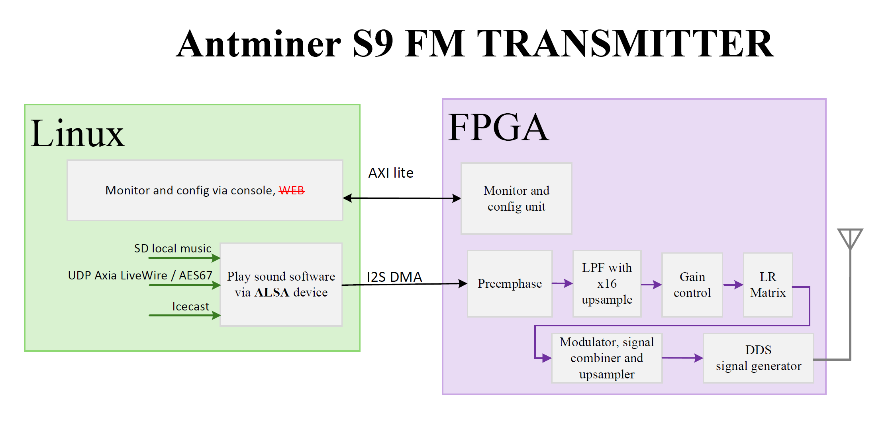
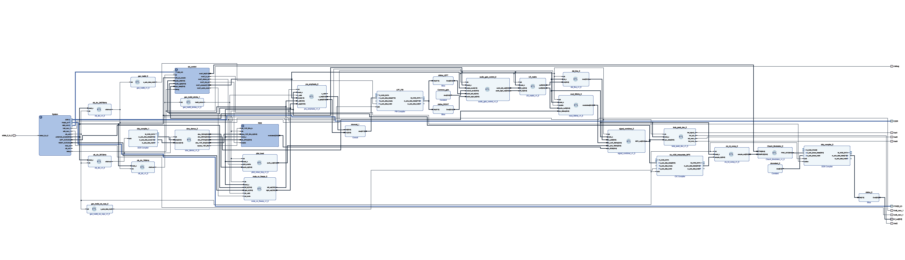
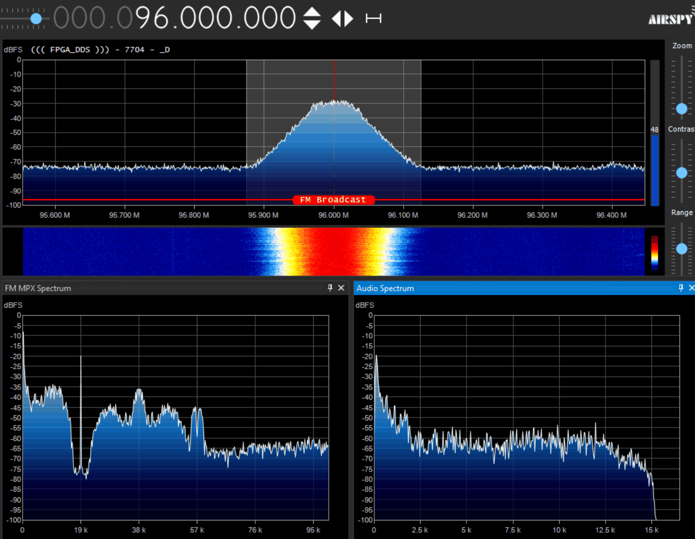
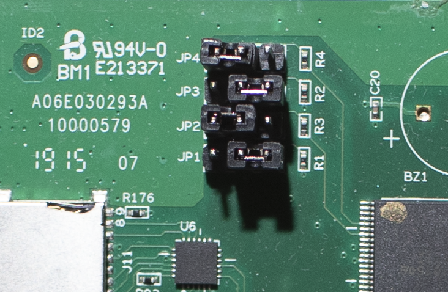
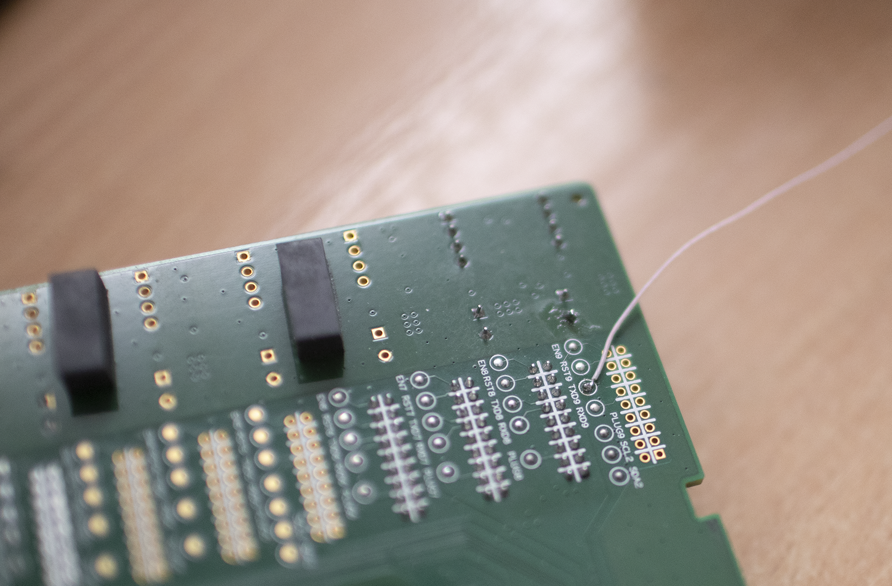
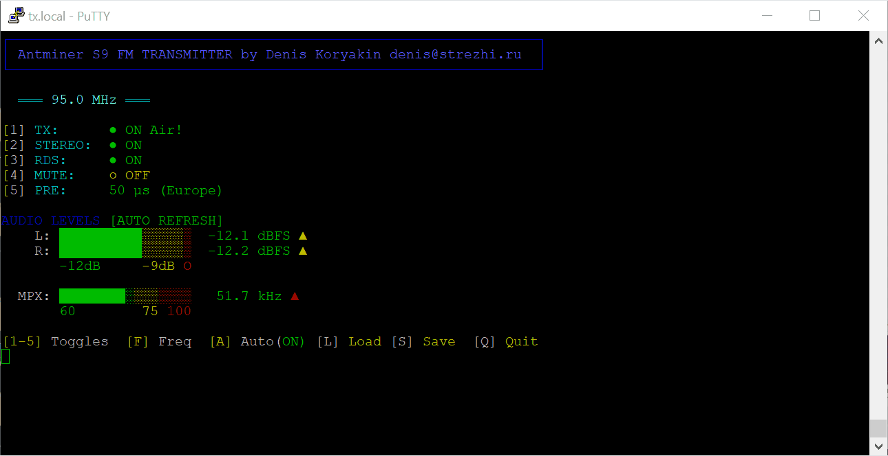
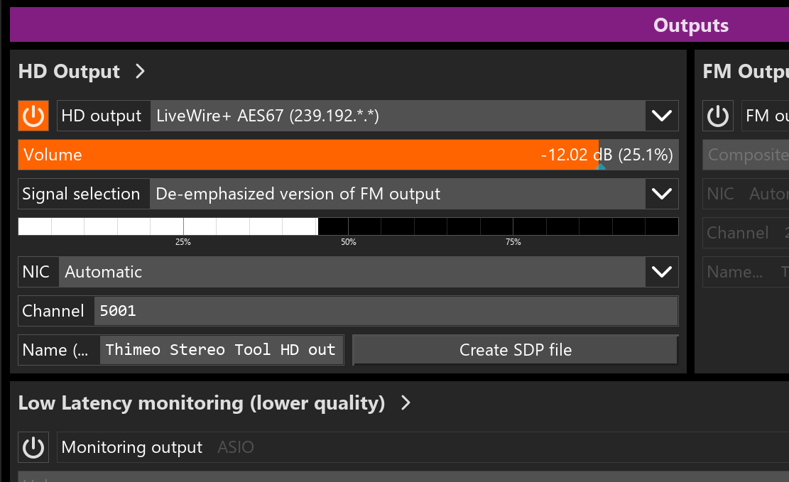

# Antminer S9 FM Stereo Modulator

**Стерео FM-модулятор на базе ПЛИС платы Antminer S9 / Astra S9 без внешнего ЦАП.** Прямой цифровой синтез (DDS) для экспериментального FM-вещания.

**English version available:** [README in English](README.en.md)

[]()
[-lightgrey)]()

## ⚠️ Важное предупреждение
Это **экспериментальный проект** для энтузиастов. Устройство может создавать помехи другим радиостанциям и службам. Используйте с осторожностью.

## 📋 Особенности
*   **Полный цифровой тракт:** Генерация FM-сигнала прямо в ПЛИС Zynq
*   **Высокое качество звука:** Прямой цифровой синтез (DDS) гарантирует чистый звук с отличной детализацией и атакой, на уровне или даже лучше многих промышленных FM-передатчиков
*   **Стереозвук:** Формирование MPX-сигнала с пилот-тоном
*   **Готовность к RDS:** Модулятор RDS уже есть в ПЛИС, нужна программная часть
*   **Разные источники звука:**
    *   Интернет-радио (через VLC, MPC, gstreamer, madplay и т.п. )
    *   Локальные аудиофайлы
*   **Потоки по протоколу Axia LiveWire (AES67):** Поддержка профессиональных аудиосетей, в том числе вывод из **StereoTool**
*   **Управление через консоль:** Утилита для настройки частоты, контроля уровней и управления передатчиком
*   **Недорогое решение:** Используем старую майнинг-плату

---

## 📸 Демонстрация

### Архитектура проекта


*Общая схема проекта: взаимодействие ядра Linux (PS) и программируемой логики (PL) на плате Zynq*

### Проект в Vivado


*Схема проекта в Vivado с реализацией DDS и MPX модулятора*

### Спектр в SDR#


*Спектр MPX-сигнала в SDR#: виден основной канал L+R (до 15 kHz), пилот-тон 19 kHz, стереоподнесущая L-R 38 kHz и RDS на 57 kHz*

### Подготовка платы

#### 1. Установка джамперов для загрузки с SD-карты


*Установите джамперы в таком порядке для загрузки с SD-карты*

#### 2. Место пайки антенны


*Место пайки антенны на плате - контакт TXD9 на обратной стороне*

---

## 🚀 Быстрый старт

1.  **Образ SD-карты:** Скачайте и запишите образ на флешку:
    [📥 **antminer_fm_sd_image.img.zip**](https://drive.google.com/file/d/1zJ9alWn_ooUUDolYVYJMz_-qFWlah9bX/view?usp=sharing)

2.  **Установка джамперов:** Установите джамперы на плате в положение для загрузки с SD-карты, как показано на фото выше.

3.  **Антенна:** Припаяйте провод ~78 см к контакту **TXD9** на **обратной стороне** платы (см. фото места пайки).

4.  **Сеть:** Подключите плату через Ethernet к сети с DHCP и интернетом.

5.  **Приём:** Настройте FM-приёмник на **96.0 МГц**. Несущая появится примерно через пол минуты после включения питания, как только загрузится линукс.

6.  **Готово:** После загрузки системы автоматически запустится скрипт и в эфире зазвучит трансляция интернет-радио.

> ℹ️ **Примечание:** Чтобы отключить автозапуск интернет-радио, закомментируйте строку `/root/ep.sh` в файле `/etc/rc.local`.

---

## 🛠 Использование

### Консольная утилита управления `fm`
После загрузки системы подключитесь по SSH к fm.local и запустите програму командой    
```bash
/root/fm
```
Она предоставляет интерфейс для настройки параметров передатчика и мониторинга.
Нажмите клавишу "A" что бы включить автообновление регуляторов уровня.


**Сборка из исходного кода (при необходимости):**
```bash
gcc fm.c -o fm -lm
```

**Консоль интерфейса управления:**


**Клавиши управления:**
*   `1-5` – Включить/выключить соответствующий параметр (TX on/off, STEREO, RDS, MUTE, Pre-emphasis).
*   `F` – Изменить частоту вещания.
*   `A` – Включить автопобновление индикаторов уровня.
*   `L` – Загрузить конфигурацию из файла (`/etc/fm_transmitter.conf`).
*   `S` – Сохранить текущую конфигурацию.
*   `Q` – Выйти из утилиты.

Все настройки сохраняются в файл `/etc/fm_transmitter.conf`.

### Воспроизведение аудио
*   **Локальный файл:** Воспроизведение тестового аудиофайла:
    ```bash
    ./play_song.sh
    ```
*   **Интернет-радио:**
    ```bash
    ./ep.sh
    ```
    Остановить вещание: `killall vlc`.
*   **Воспроизведение Axia LiveWire (AES67):**
    ```bash
    ./rx_livewire_aes67.sh [номер_канала]
    ```
    Пример для 51-го канала: `./rx_livewire_aes67.sh 51`.

### Как вывести звук из StereoTool:


1.  В программе StereoTool **включите** HD output.
2.  В выпадающем меню **выберите** LiveWire+ AES67 или Generic AES67.
3.  **Установите** ползунок Volume на **25%**.
4.  В поле **Signal selection** укажите **"De-emphasized version of FM output"**.
5.  Поле **NIC** можно оставить в **Авто**, номер канала задайте любой, но он должен совпадать с настройкой на стереомодуляторе.
6.  **По SSH** зайдите на плату (`tx.local`, логин `root`), перейдите в папку `/root` и запустите скрипт с номером канала, например:
    ```bash
    ./rx_livewire_aes67.sh 5001
    ```
    Звук будет передаваться по сети через UDP Multicast — IP-адрес сетевой карты не важен.

---

## ❓ FAQ (Часто задаваемые вопросы)

### Какое реальное качество звука?
**Чистейший стереозвук без аналоговых искажений.** Единственный недостаток - Иногда есть вероятность услышать слабый цифровой шум в тишине, но в большинстве случаев он незаметен.

### Какая реальная дальность?
**В городских условиях:** 100-200 метров  
**На открытой местности при прямой видимости:** до 300-400 метров  
Дальность также зависит от чувствительности приёмника, наличия помех и используемых антенн.

### Как передавать звук с компьютера?
Установите виртуальную звуковую карту Axia LiveWire, и ваш компьютер станет профессиональным источником звука для передатчика. Подробная инструкция для вывода из StereoTool приведена выше.

### Как зайти по SSH?
Подключайтесь по SSH к хосту **tx.local** (логин **root**, без пароля).

### Можно ли изменить частоту?
Да, можно менять прямо из консольной утилиты `./fm` (нажмите клавишу `F`).
Или прямой выбор -  `./set_freq 96.5`

### Как увеличить мощность?
Данный вариант реализации это не предусматривает, так как при использовании усилителя вместе с полезным сигналом вы увеличите и уровень шумов, которых слишком много.

### Подойдет ли плата от других майнеров?
Да, если там Zynq 70xx и похожая архитектура.

### Какой уровень звука оптимален для полной девиации в +/-75кГц?
Полная девиация в +/-75 килогерц, включая девиацию RDS и пилот тона будет соответствовать уровню звука в -9dBFS (синус 1000Гц).

### Какой уровень выходной мощности?
При подключении измерителя мощности с волновым сопротивлением 50 Ом напрямую, без согласующих элементов, она составила в районе 16 мВт.

---

## 🤝 Помощь проекту

**Присоединяйтесь к обсуждению проекта в Telegram:** [https://t.me/c/2207436230/31613](https://t.me/c/2207436230/31613)

Что-то из задуманного пока не реализовано или требует доработки, но уже сейчас вы можете наслаждаться качественным стереозвуком.

**Приоритетные задачи:**
*   **RDS Encoder:** Реализация программной части для уже готового модулятора в ПЛИС
*   **Интерфейс управления:** Доработка консольного интерфейса и создание Web-интерфейса для настройки частоты, преэмфазиса, контроля параметров модуляции и т.п.
*   **Многоканальность:** При должной оптимизации будет возможно передавать в эфир одновременно минимум 2-4 радиостанции.
*   **Документация:** Улучшение инструкций и технических описаний

Если у вас есть опыт в FPGA, SDR, embedded Linux или разработке веб-интерфейсов — присоединяйтесь!

---